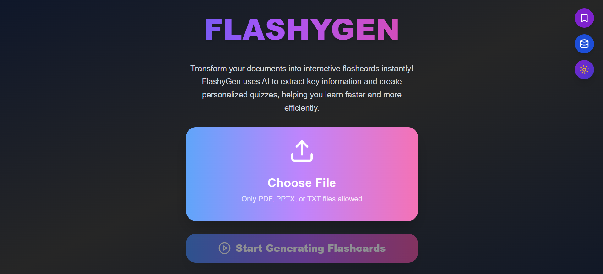

# FLASHYGEN - AI Flashcard Generator


*(Optional: You can replace the placeholder above with a real logo or screenshot later!)*

## Project Description

Transform your documents into interactive flashcards instantly! FlashyGen uses AI to extract key information and create personalized flashcards, helping you learn faster and more efficiently. This application aims to streamline the study process by automating flashcard creation from various document types.

---

## 🚀 Features

-   **Upload PDF, PPTX, or TXT files** and generate flashcards automatically.
-   **Interactive Flashcards:** Flip cards to reveal answers.
-   **Save/Unsave Cards:** Bookmark individual flashcards to save them to your personal library in the cloud (Firebase Firestore).
-   **Quiz Library:** Save, load, rename, and delete entire generated quizzes from your cloud library (Firebase Firestore).
-   **Theme Toggle:** Switch between dark and light modes for comfortable viewing.
-   **Animated, Modern UI:** Engaging user interface with smooth transitions and feedback.
-   **Real-time Sync:** All saved data (quizzes and individual cards) syncs in real-time with Firebase Firestore.
-   **Anonymous Authentication:** Instant access to cloud features without requiring explicit sign-up.

---

## 🖼️ Screenshots



---

## 🛠️ Getting Started (Local Development)

To run FlashyGen locally, you need to set up both the frontend (React) and the backend (FastAPI).

### Prerequisites

Before you begin, ensure you have the following installed:

* **Node.js & npm:** (LTS version recommended)
* **Python 3.8+**
* **Firebase Project:** You'll need a Firebase project set up for Firestore.
* **Ollama:** For running local Large Language Models (LLMs).

### Installation Steps

1.  **Clone the Repository:**
    ```bash
    git clone https://github.com/Jerielphilly/FlashyGen.git
    cd FlashyGen
    ```
    *Note: This repository is structured as a monorepo, containing both `backend` and `frontend` folders.*

2.  **Backend Setup (FastAPI):**
    ```bash
    cd backend
    pip install -r requirements.txt
    ```
    *(If you don't have a `requirements.txt`, you can list main dependencies: `pip install fastapi uvicorn python-multipart pymupdf python-pptx ollama`)`*

    **Start your FastAPI server:**
    ```bash
    uvicorn main:app --reload --port 8000
    ```
    *Keep this terminal window open and running. The frontend expects the backend to be on `http://localhost:8000`.*

3.  **Frontend Setup (React):**
    ```bash
    cd ../frontend # Navigate back to the root and then into the frontend folder
    npm install # or yarn install
    ```

4.  **Configure Firebase:**
    * Open `src/App.jsx`.
    * Ensure the `firebaseConfig` object at the top of the file matches the configuration from your Firebase project.
    * **Crucially, set up Firestore Security Rules in your Firebase Console** (`flashygen-8c134` project) to allow authenticated users to read and write to their specific paths.
        * Go to [Firebase Console](https://console.firebase.google.com/) -> Select your project -> `Build` -> `Firestore Database` -> `Rules` tab.
        * **Replace your entire rules content with the following:**
            ```firestore
            rules_version = '2';
            service cloud.firestore {
              match /databases/{database}/documents {
                // Allow authenticated users to read and write their own data
                // This rule applies to any collection or document nested under the user's path.
                match /artifacts/{projectId}/users/{userId}/{documents=**} {
                  allow read, write: if request.auth != null && request.auth.uid == userId;
                }
              }
            }
            ```
        * **Click the "Publish" button** after updating the rules. Allow a minute or two for changes to propagate.

5.  **Start Ollama:**
    * If you haven't already, download and install Ollama from [ollama.com](https://ollama.com/).
    * Download an LLM model (e.g., Llama 3 or Mistral, as your backend expects):
        ```bash
        ollama pull mistral # or ollama pull llama3
        ```
    * Start the Ollama server:
        ```bash
        ollama serve
        ```
    *Keep this terminal window open and running.*

6.  **Run the React Frontend:**
    ```bash
    npm start # or yarn start
    ```
    *This will open the FlashyGen application in your browser, usually at `http://localhost:3000`.*

---

## ⚡ Usage

1.  **Upload a Document:** On the homepage, click the "Choose File" button to upload a PDF, PPTX, or TXT document.
2.  **Generate Flashcards:** Click "Start Generating Flashcards" and wait for the AI to process your document and create the quiz.
3.  **Interactive Study:** Flip through the generated flashcards.
4.  **Save Individual Cards:** Click the bookmark icon on any flashcard to save it to your personal "Saved Cards" library.
5.  **Manage Quizzes:** Use the "Quiz Library" button to save the entire generated quiz, load previous quizzes, rename them, or delete them.

---

## 📚 License

This project is licensed under the MIT License.
See the [LICENSE](LICENSE) file for details.

---

## 🙌 Contributing

Pull requests are welcome! For major changes, please open an issue first to discuss what you would like to change.

---

## 💡 Credits

* [React](https://react.dev/)
* [FastAPI](https://fastapi.tiangolo.com/)
* [Firebase](https://firebase.google.com/)
* [Ollama](https://ollama.com/)
* [Tailwind CSS](https://tailwindcss.com/)
* [Lucide Icons](https://lucide.dev/)

---

## 📬 Contact

Questions or feedback?
Open an issue on GitHub or reach out at [jerilphilly@gmail.com](mailto:jerilphilly@gmail.com)

---